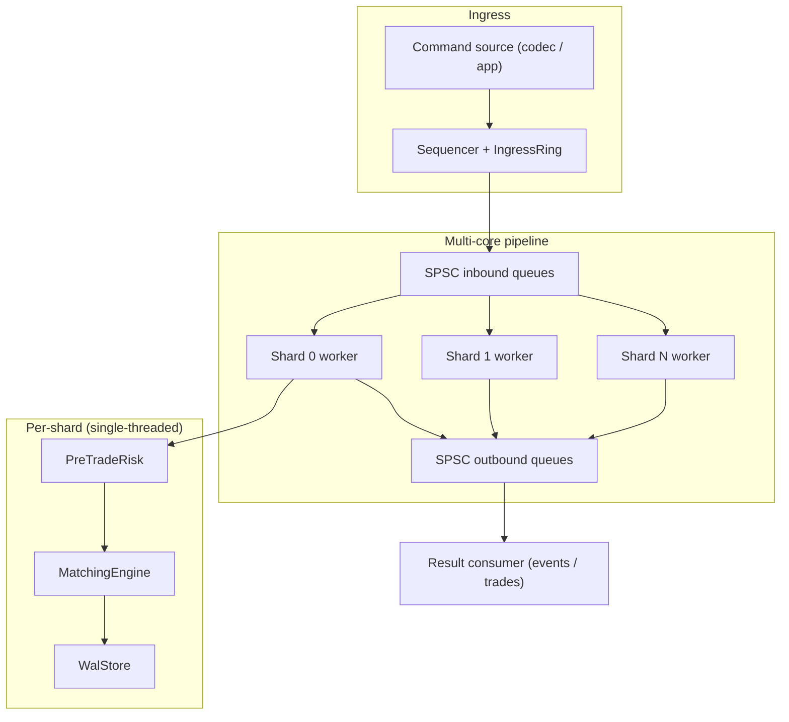

# matching-engine-cpp

**Author:** Harsh1s

A deterministic, price-time-priority matching engine in modern C++17. This is a
faithful C++ reimplementation of my Python matching engine, ported one-to-one so
the same semantics run natively without the interpreter.

## Features

- Integer tick prices and integer quantities (no floating point on the book)
- Price-time priority with passive-price execution
- Time-in-force: `GTC`, `IOC`, `FOK`, `MARKET`
- Cancel and replace (replace = cancel + re-add, preserving participant/side)
- Self-trade prevention: `NONE`, `CANCEL_AGGRESSOR`, `CANCEL_PASSIVE`, `CANCEL_BOTH`
- Pre-trade risk controls (quantity, price band, notional)
- Compact fixed-header big-endian binary codec (add/cancel/replace)
- Symbol sharding with per-shard WAL (JSON-lines), snapshot, and replay
- Strict ingress-sequencing support via a gateway sequencer + ingress ring
- Invariants enforced with exceptions (e.g. the resting book never crosses)

### Performance / systems

- Lock-free, cache-line-padded **SPSC ring buffer** (`spsc_queue.hpp`)
- **Per-shard worker threads** with best-effort core pinning, fed by SPSC inbound
  queues and publishing async results on SPSC outbound queues
  (`ThreadedShardedEngine`)
- **Symbol interning** to dense 32-bit ids (`symbol_table.hpp`)
- Durable WAL: **CRC-32 per record** (torn-tail detection), **group commit**,
  **atomic snapshot** (temp file + `fsync` + `rename`), WAL truncation on
  snapshot, and snapshot-then-WAL recovery
- Clean under AddressSanitizer, UndefinedBehaviorSanitizer, and ThreadSanitizer

## Architecture



Each symbol routes to exactly one shard. A single pinned worker thread drives
each shard, so the matching core stays lock-free: synchronization is limited to
the SPSC queues at stage boundaries. `submit()` is single-producer;
`drain()` is single-consumer.

> **Roadmap:** the ingress/egress edges are in-process today. A natural next step
> is to front them with a network layer — a TCP order-entry gateway (with a
> CRC-framed wire protocol) feeding the SPSC pipeline, and a UDP multicast feed
> publishing the result stream — without touching the matching core.

## Design

```
bids: std::map<price, std::list<RestingOrder>>   // best bid = highest key
asks: std::map<price, std::list<RestingOrder>>   // best ask = lowest key
index: order_id -> physical location             // O(1) cancel
```

- Best bid/ask is O(1) (`std::prev(end())` / `begin()`).
- FIFO within a price level is the `std::list` insertion order.
- Cancel is physical (no tombstones) via the `order_id` index.
- Add: O(1) into an existing level, O(log L) for a new level, O(F) per fill.

### Multi-core pipeline

```
producer --SPSC--> [shard 0 worker] --SPSC--> consumer (drain/publish)
         --SPSC--> [shard 1 worker] --SPSC-->
         ...
```

Each symbol routes to exactly one shard, and each shard is driven by a single
pinned thread, so the matching core stays lock-free: the only synchronization is
the lock-free SPSC queues at the stage boundaries. `submit()` is single-producer;
`drain()` is single-consumer.

## Build

```bash
cmake -S . -B build
cmake --build build
```

With sanitizers (ASan + UBSan):

```bash
cmake -S . -B build-san -DCMAKE_BUILD_TYPE=Debug -DENABLE_SANITIZERS=ON
cmake --build build-san
```

## Run the demo

```bash
./build/matching_engine_demo
```

## Run the tests

```bash
ctest --test-dir build --output-on-failure
# or directly:
./build/matching_engine_tests
```

## Layout

```
include/   public headers:
             core      types, matching_engine, sharded, risk, gateway, json
             systems   spsc_queue, threaded_engine, symbol_table
             io        protocol, recovery, checksum
src/       implementation + demo (main.cpp)
tests/     assert-based test suite (engine semantics + SPSC, threaded engine,
           binary codec, WAL recovery)
```

## Notes

- The WAL/snapshot format uses a small built-in JSON writer/parser (no external
  dependencies) so the project builds with only a C++17 compiler and CMake.
- Sharding uses a 64-bit FNV-1a hash of the symbol. The original Python build
  sharded on `blake2b`, so WAL files are not cross-compatible between the two by
  design; each store is internally consistent.
